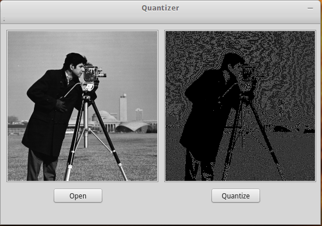

## PCNNQuantizer
基于 QT 图形界面，使用 Pulse Coupled Neural Network(PCNN) 算法对图像进行量化，最后移植到 Mini2440(ARM9) 嵌入式平台。

PCNN 是脉冲耦合神经网络模型，具有很好的同步脉冲发放特性。同时对于图像来说，产生的时间序列脉冲不受图像旋转、放大、缩小影响，这个性质可以用来减少图像处理中的几何变换，也可以用来提取图像特征。从 2-D 图像到 1-D 时间序列脉冲，这实质上就是降维。

具体实现原理参见 [PCNN 量化算法原理](http://link.springer.com/chapter/10.1007/978-3-319-25393-0_30)。

## 目录结构

```
.
├── cameraman.bmp #测试图片
├── main.cpp 
├── quantizer.cpp #主要的类
├── quantizer.h
├── Quantizer.pro
├── Quantizer.pro.user
├── quantizer.ui #UI界面
├── utils.cpp #算法和工具类
└── utils.h
```

## 方法

在 utils.cpp 中实现了下列方法，主要是参数计算和格式转换。

```
    QImage RGBtoGray(QImage image);          //QT 中 RGB 图片转换为灰度图
    double** QImagetoArray(QImage image);    //QT QImage 类型转换为二维数组形式，便于后续处理
    QImage arraytoQImage(double** array);    //二维数组转换为 QT QImage 类型，便于显示图形

    double caculateStd2(double **image);     //计算二维矩阵标准差
    int caculateGraythresh(double** image);  //计算直方图最佳阈值
    dynamicParameter caculatePCNNParameters(double** image);     //计算 PCNN 动态参数
    void caculateConv2(double image[][WID], double filter[][3]); //计算矩阵和算子的卷积

    double** allocateHeap(int rows, int cols);  //给二维数组分配堆内存
    void releaseHeap(double** A, int rows);     //释放堆内存
 
    double** PCNNQuantize(double** image);      //对图像进行量化
```

## 界面


